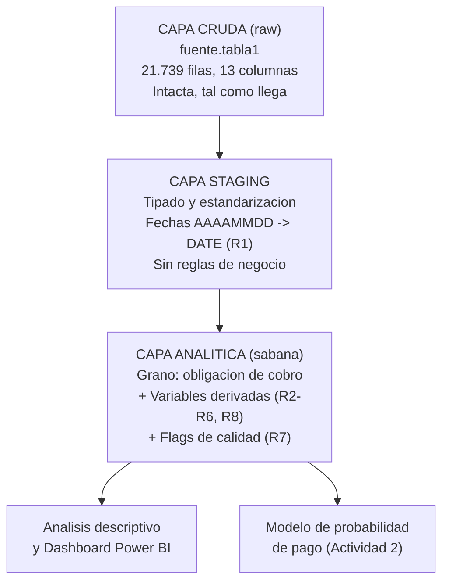

# Modelo conceptual de la sábana de datos — Cuentas por Cobrar

## Objetivo

Transformar la fuente cruda (una tabla transaccional sin procesar) en una **sábana
analítica** a grano de obligación de cobro, que consolide variables originales,
variables derivadas, reglas de negocio y flags de calidad, lista para el análisis
descriptivo y para el modelo de probabilidad de pago.

## Arquitectura por capas

Se adopta una arquitectura en tres capas (patrón medallón simplificado). Cada capa
tiene una responsabilidad única, lo que hace el proceso auditable y reproducible.

- **Capa cruda:** la fuente sin tocar. Garantiza trazabilidad al origen.
- **Capa staging:** solo tipado y limpieza estructural (fechas a DATE). Aquí se aplica
  R1. No hay reglas de negocio todavía.
- **Capa analítica (sábana):** se aplican las reglas de negocio R2 a R8 y los controles
  R7. Es la tabla que consumen el análisis y el modelo.

## Catálogo de variables de la sábana

### Variables originales (se conservan)

| Variable | Origen | Descripción |
|---|---|---|
| `cod_apli_prod` | fuente | Código del producto |
| `descri_cod_apli_prod` | fuente | Producto (AHORRO / CORRIENTE) |
| `num_cta` | fuente | Titular de la cuenta (grano cuenta) |
| `vlr_original` | fuente | Valor original de la obligación |
| `vlr_pagado` | fuente | Valor recuperado |
| `vlr_pendiente_pago` | fuente | Valor pendiente |
| `cod_trn` | fuente | Código de transacción |
| `descri_cod_trn` | fuente | Tipo de transacción |

### Variables derivadas

| Variable | Regla | Descripción |
|---|---|---|
| `fecha_creacion` | R1 | `f_creacion` (entero) convertido a DATE |
| `fecha_ultimo_pago` | R1 | `f_ultimo_pago` (entero) convertido a DATE |
| `estado_recuperacion` | R2 | PAGADA_TOTAL / PAGO_PARCIAL / SIN_PAGO |
| `tasa_recuperacion` | R3 | `vlr_pagado / vlr_original` |
| `dias_gestion` | R4 | Días entre creación y último pago |
| `dias_desde_creacion` | R5 | Días entre creación y la fecha de corte |
| `banda_antiguedad` | R5 | 0–30 / 31–60 / 61–90 / 91+ |
| `flag_reciente` | R6 | Obligación con poca maduración (censura) |
| `pagada_total` | R8 | Variable objetivo del modelo (1/0) |

### Flags de control de calidad (R7)

| Variable | Descripción | Casos hoy |
|---|---|---|
| `flag_inconsistencia_contable` | original ≠ pagado + pendiente | 0 |
| `flag_fecha_invertida` | último pago antes de la creación | 0 |
| `flag_pago_mayor_original` | pagado mayor que el original | por verificar |

## Principios de construcción

1. **Idempotencia:** el proceso SQL se puede volver a ejecutar sin duplicar datos ni
   alterar resultados.
2. **Trazabilidad:** cada variable derivada referencia la regla de negocio que la
   define, y cada regla su hallazgo de origen.
3. **Separación de responsabilidades:** limpieza estructural (staging) separada de las
   reglas de negocio (analítica).
4. **Grano explícito:** la sábana es a nivel obligación; la agregación a nivel titular
   (`num_cta`) o tipo de transacción se hace sobre ella cuando el análisis lo requiere.
